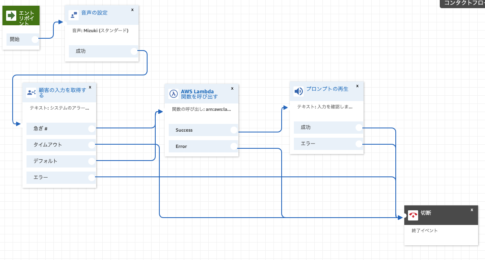

# AlarmCall
CloudWatchのアラートをAmazon Connectで発信する

## 1.Download

Githubから、コード等をダウンロードします。

```
$ git clone https://github.com/furuya02/AlarmCall.git
$ cd AlarmCall
```

## 2.共通スタック

AlarmCallCommonStackをdeployし、共通のリソースを作成します。

```
$ yarn install
$ tsc
$ cdk deploy AlarmCallCommonStack
```

作成されるリソースは、以下の通りです。

* Lambda(AlarmCall_SaveId)
 Amazon Connectのフローの中で使用され、キー入力があった場合にidを保存する
* Lambda(AlarmCall_Iterator)
StepFunctionsの中で使用され、カウンターをインクリメントして、ループを継続するかどうかを返す
* DynamoDB(AlarmCall_Table)
Amazon Connectのフローの中で使用され、キー入力があった場合にidを保存する
* StepFunctions(AlarmCall_StateMachine)


## 3.Amazon Connect

Amazon Connectのインスタンスで、共通スタックで作成されたLambdaを使用可能にします


コンタクトフローを作成します

※ 下記のフォルダにサンプルがあるので、インポートして利用して下さい。

```
AlarmCall/CallFlow/AlarmCallFlow
```



Lambda関数を紐付けます


## 4.共通スタック（更新）

Amazon Connectの各種IDをcdk.jsonに転記します。

※ 各IDは、URL等から取得可能です
<br>[[Amazon Connect] StartOutboundVoiceContactや、GetCurrentMetricDataで必要となる各種IDの取得方法（小ネタ）](https://dev.classmethod.jp/articles/amazon-connectid-instanceid-queueid/)

例)

**cdk.json**
```
{
　・・・略・・・
  "context": {
    ・・・略・・・
    "contactFlowId": "xxxxxxxx-cec9-431c-a71b-xxxxxxxxxxxx",
    "instanceId": "xxxxxxxx-6260-42bf-b4b1-xxxxxxxxxxxx",
    "queueId": "xxxxxxxx-f501-4995-9eef-xxxxxxxxxxxx"
  }
}
```

Amazon Connect と連携させるため、共通スタックを再度デプロイ（更新）します

```
$ tsc
$ cdk deploy AlarmCallCommonStack
```

## 5.個別スタック

個別スタックは、アラーム毎にデプロイします。

* name: 個別名（スタックを区別するために命名します「個人名等」）
* phoneNumber: コールする電話番号
* maxRetries: 着信が確認できなかった時に繰り返す回数
* waitSecinds: 繰り返すまでに待機する時間（秒）
* alarmArn: トリガーするアラームのarn


AlarmCallStack-{name}のnameは、-c name=で指定したものと一致している必要があります。

例）testAlarmが、ARAM状態になると、+8190xxxxxxxx宛にタイムアウト60秒、再試行2回で発信します。


```
% cdk deploy AlarmCallStack-JohnSmith -c name=JohnSmith -c phoneNumber=+8190xxxxxxxx -c waitSecinds=60 -c maxRetries=2 -c alarmArn=arn:aws:cloudwatch:ap-northeast-1:439028474478:alarm:testAlarm
```
例）sampleAlarmが、ARAM状態になると、+8190xxxxxxxx宛にタイムアウト120秒、再試行3回で発信します。

```
% cdk deploy AlarmCallStack-YamadaTaro -c name=YamadaTaro -c phoneNumber=+8190xxxxxxxx -c waitSecinds=120 -c maxRetries=3 -c alarmArn=arn:aws:cloudwatch:ap-northeast-1:439028474478:alarm:sampleAlarm
```

